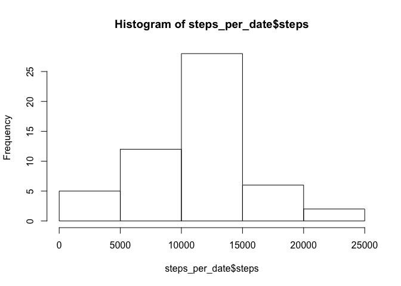
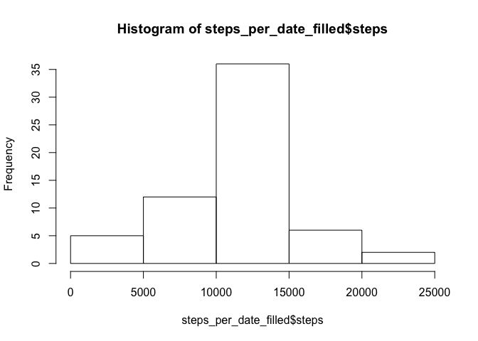
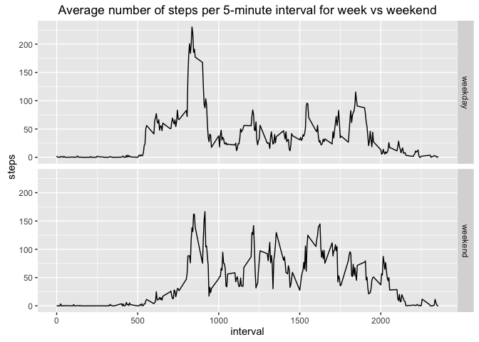

# Reproducible Research: Peer Assessment 1
Geert Scholma  
6 Mar 2016  


### Loading and preprocessing the data

To make this script work, set working directory to source file location

1. Load the data (i.e. `read.csv()`)


```r
data <- read.csv(unz("activity.zip", "activity.csv"))
```

2. Process/transform the data (if necessary) into a format suitable for your analysis

No more processing needed so we proceed to the next step.

### What is mean total number of steps taken per day?

For this part of the assignment, you can ignore the missing values in
the dataset.


```r
# install.packages("dplyr")
library(dplyr)
```

```
## 
## Attaching package: 'dplyr'
```

```
## The following objects are masked from 'package:stats':
## 
##     filter, lag
```

```
## The following objects are masked from 'package:base':
## 
##     intersect, setdiff, setequal, union
```

```r
data_by_date <- group_by(data[,1:2], date)
steps_per_date <- summarise(data_by_date, sum(steps))
names(steps_per_date)[2] <- "steps"
```

1. Make a histogram of the total number of steps taken each day


```r
hist(steps_per_date$steps)
```



2. Calculate and report the **mean** and **median** total number of steps taken per day


```r
# mean number of steps per day:
mean(steps_per_date$steps, na.rm = TRUE)
```

```
## [1] 10766.19
```

```r
# median number of steps per day:
median(steps_per_date$steps, na.rm = TRUE)
```

```
## [1] 10765
```

### What is the average daily activity pattern?

1. Make a time series plot (i.e. `type = "l"`) of the 5-minute interval (x-axis) and the average number of steps taken, averaged across all days (y-axis)


```r
data_by_interval <- group_by(data[,c(1,3)], interval)
steps_per_interval <- summarise(data_by_interval, mean(steps,na.rm = TRUE))
names(steps_per_interval)[2] <- "steps"
plot(steps_per_interval, type="l")
```


2. Which 5-minute interval, on average across all the days in the dataset, contains the maximum number of steps?


```r
steps_per_interval[which.max(steps_per_interval$steps),1]
```

```
## Source: local data frame [1 x 1]
## 
##   interval
##      (int)
## 1      835
```

### Imputing missing values

Note that there are a number of days/intervals where there are missing
values (coded as `NA`). The presence of missing days may introduce
bias into some calculations or summaries of the data.

1. Calculate and report the total number of missing values in the dataset (i.e. the total number of rows with `NA`s)


```r
# total number of missing values in the column steps:
sum(is.na(data$steps))
```

```
## [1] 2304
```

```r
# total number of missing values in any column:
nrow(data)-sum(complete.cases(data))
```

```
## [1] 2304
```

2. Devise a strategy for filling in all of the missing values in the dataset. The strategy does not need to be sophisticated. For example, you could use the mean/median for that day, or the mean for that 5-minute interval, etc.

I choose to use the mean per 5-minute interval to fill in the gaps.

3. Create a new dataset that is equal to the original dataset but with the missing data filled in.


```r
data_complete <- data[complete.cases(data),]
data_filled <- data
data_missing <- data_filled[is.na(data_filled$steps),2:3]
data_missing <- merge(data_missing[,], steps_per_interval, by = "interval")[,c(3,2,1)]
data_filled <- rbind(data_complete, data_missing)
```

4. Make a histogram of the total number of steps taken each day and Calculate and report the **mean** and **median** total number of steps taken per day. 


```r
data_filled_by_date <- group_by(data_filled[,1:2], date)
steps_per_date_filled <- summarise(data_filled_by_date, sum(steps))
names(steps_per_date_filled)[2] <- "steps"
hist(steps_per_date_filled$steps)
```



```r
# mean number of steps per day:
mean(steps_per_date_filled$steps, na.rm = TRUE)
```

```
## [1] 10766.19
```

```r
# median number of steps per day:
median(steps_per_date_filled$steps, na.rm = TRUE)
```

```
## [1] 10766.19
```

Do these values differ from the estimates from the first part of the assignment? 

The mean hasn't changed from the first estimate, because we have filled in all gaps with the mean. 
The median has changed to the mean, because we have filled in 8 daily gaps with the mean (), whereas the original mean and median were different from each other and the original frequency of the median was 1.


```r
# the max frequency of the orinal total steps per day was 1, so there were no doubles
max(table(steps_per_date$steps))
```

```
## [1] 1
```

```r
# the number of dates that have been filled with the mean steps per date was 8
sum(is.na(steps_per_date))
```

```
## [1] 8
```

What is the impact of imputing missing data on the estimates of the total daily number of steps?


```r
# first we sum up the original total number of steps
sum(data$steps, na.rm = TRUE)
```

```
## [1] 570608
```

```r
# then we sum up the filled total number of steps
sum(data_filled$steps, na.rm = TRUE)
```

```
## [1] 656737.5
```

```r
# the number of steps added in the filled data is
sum(data_filled$steps, na.rm = TRUE) - sum(data$steps, na.rm = TRUE)
```

```
## [1] 86129.51
```

### Are there differences in activity patterns between weekdays and weekends?

For this part the `weekdays()` function may be of some help here. Use
the dataset with the filled-in missing values for this part.

1. Create a new factor variable in the dataset with two levels -- "weekday" and "weekend" indicating whether a given date is a weekday or weekend day.


```r
data_daytype <- data_filled
data_daytype$date <- as.Date(data_daytype$date)
data_daytype$daytype <- weekdays(data_daytype$date)
data_daytype$daytype[data_daytype$daytype == "Saturday" | data_daytype$daytype == "Sunday"] <- "weekend"
data_daytype$daytype[data_daytype$daytype != "weekend"] <- "weekday"
data_daytype$daytype <- as.factor(data_daytype$daytype)
```

1. Make a panel plot containing a time series plot (i.e. `type = "l"`) of the 5-minute interval (x-axis) and the average number of steps taken, averaged across all weekday days or weekend days (y-axis).


```r
# first calculate the 5-minute interval average number of steps per daytype
data_daytype_by_interval <- group_by(data_daytype[,c(1,3:4)], interval, daytype)
data_by_interval_daytype <- summarise(data_daytype_by_interval, mean(steps))
names(data_by_interval_daytype)[3] <- "steps"

# install ggplot package
# install.packages("ggplot2")
library(ggplot2)
```

```
## Warning: package 'ggplot2' was built under R version 3.2.4
```

```r
ggplot(data_by_interval_daytype, aes(x=interval, y=steps)) +
    geom_line() +
    ggtitle("Average number of steps per 5-minute interval for week vs weekend") +
    facet_grid(daytype ~ .)
```


